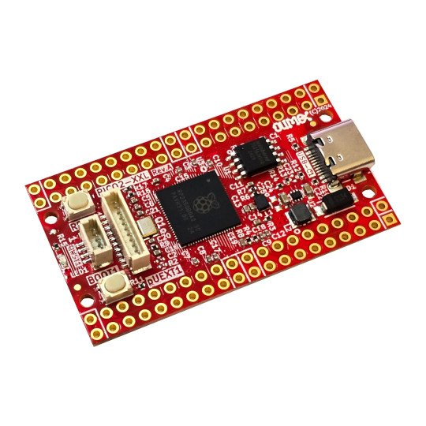

# RP2350-PICO2-XXL
RP2350B PICO2 development board exposing 48 GPIO

https://www.olimex.com/Products/RaspberryPi/PICO/PICO2-XXL/

## Licensee
* Hardware is released under CERN Open Hardware Licence Version 2 - Strongly Reciprocal
* Software is released under GPL V3 Licensee
* Documentation is released under CC BY-SA 4.0